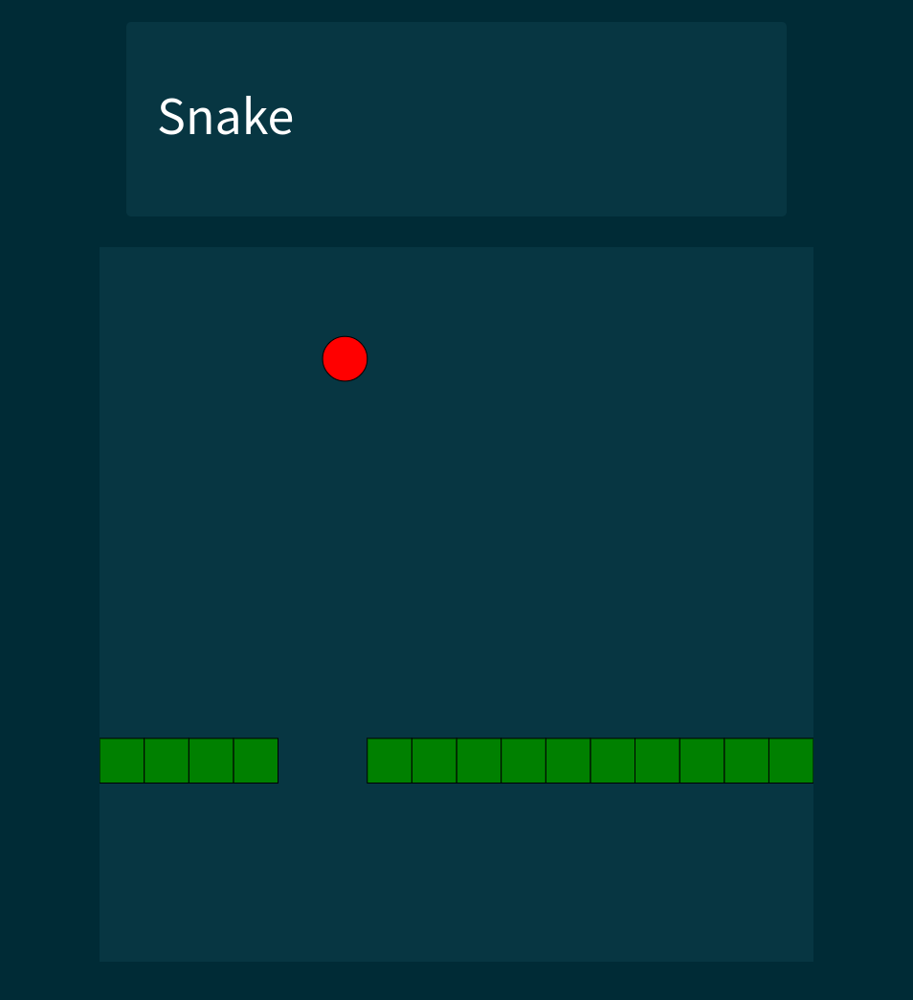

# Snake

The classic game.

To run this you'll need [Logtalk installed](https://logtalk.org/download.html),
plus [BedSit](https://github.com/PaulBrownMagic/BedSit/) and
[STRIPState](https://github.com/PaulBrownMagic/STRIPState). You'll need them in
your library paths to load as described in the BedSit README.

You'll then be able to load `loader.lgt` and everything will automatically run.
It'll search for common installs of Chromium or Chrome and run in app-mode. On MacOS you may need to add Chromium to your `PATH`:

```sh
$ export PATH=$PATH:/Applications/Chromium.app/Contents/MacOS
```

It'll likely fail for Windows machines so you might need to navigate to
[localhost:8000](http://localhost:8000) manually.

To play you can use the arrow keys or vim keys, if they're not
registering, ensure the game has focus by clicking on it.


